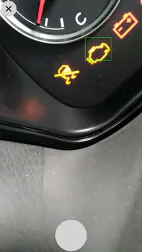
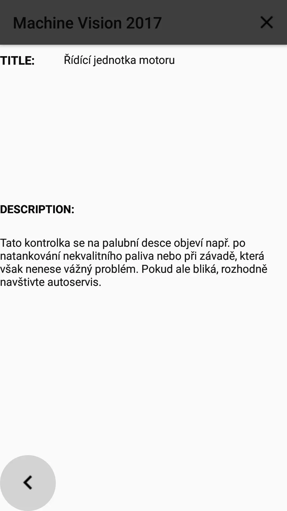

## Machine Vision 2017

Graduation Project 2017-2018.
The project is about to detect icons on a dashboard of the car.

## Dependencies

- [OpenCV 3](https://opencv.org/)
- [MoshiJSON](https://github.com/square/moshi)

## Author
Michal Kukla 2017-2018
